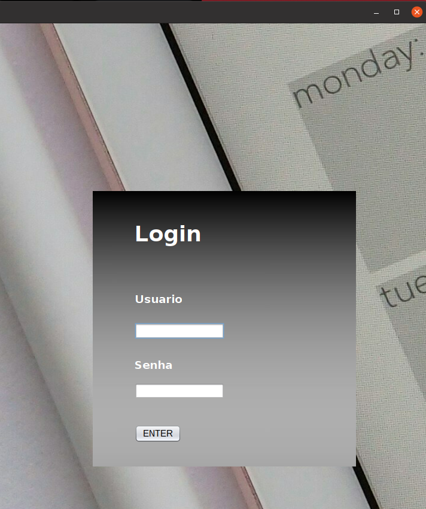

# 🎯 Sistema de Agendamentos Java - Simples, Rápido e Eficiente! ☕

Seja bem-vindo ao **Sistema de Agendamentos** mais direto e funcional que você vai ver hoje!  
Este projeto foi desenvolvido em **Java** e utiliza **MySQL** como banco de dados para armazenar seus agendamentos com segurança e performance. 🗄️⚡

---

## 📦 O que tem aqui?

Este sistema conta com **quatro janelas principais**:

🔐 **Login** – Onde tudo começa! Digite suas credenciais e entre no sistema.  

📋 **Menu** – A central de comandos! Navegue por todas as funcionalidades com facilidade.  
📝 **Cadastros** – Registre clientes, serviços e tudo mais que for preciso.  
📅 **Agendamentos** – Programe seus compromissos com estilo e organização.

---

## 🚀 Como executar?

O executável já está prontinho pra rodar!  
Basta ir até a pasta `target/agendamentos` e rodar o comando:


```bash
java -jar agendamento-1.0-SNAPSHOT-jar-with-dependencies.jar
```

## 🛠️ Configurando o Banco de Dados MySQL

Antes de rodar o sistema, é necessário criar o banco de dados e as tabelas no seu servidor MySQL.  
Abaixo está o script SQL para criar tudo rapidinho! ⚡

### 📚 Arquivo: BD.sql

### 📂 MVC - Model, View e Controller

- **Model (Modelo)**  
  Contém a lógica de negócio e as classes que representam as entidades do sistema.  
  Exemplo: `Cliente`, `Servico`, `Agendamento`.

- **View (Visão)**  
  Interface gráfica com o usuário. Inclui as telas de Login, Menu, Cadastros e Agendamentos.  
  Exemplo: `LoginView`, `MenuPrincipal`, `CadastroCliente`, `AgendamentoView`.

- **Controller (Controlador)**  
  Intermedia a comunicação entre a View e o Model, controlando o fluxo da aplicação.  
  Exemplo: `AgendamentoController`, `ClienteController`.

---

### 💾 DAO - Data Access Object

O padrão DAO é responsável por encapsular todas as operações de acesso ao banco de dados.  
Cada entidade possui sua própria classe DAO, que realiza as operações como `inserir`, `atualizar`, `remover` e `buscar`.

Exemplos:
- `ClienteDAO`
- `ServicoDAO`
- `AgendamentoDAO`

---
### 📦 DTO - Data Transfer Object

DTOs são objetos simples usados para transportar dados entre as camadas do sistema.  
Eles garantem que a transferência de informações seja feita de forma segura e consistente.

Exemplos:
- `ClienteDTO`
- `ServicoDTO`
- `AgendamentoDTO`

---
✅ **Benefícios dessa arquitetura:**
- Código mais limpo e organizado
- Fácil manutenção e testes
- Separação de responsabilidades
- Preparado para futuras expansões (como APIs REST ou novas interfaces)
